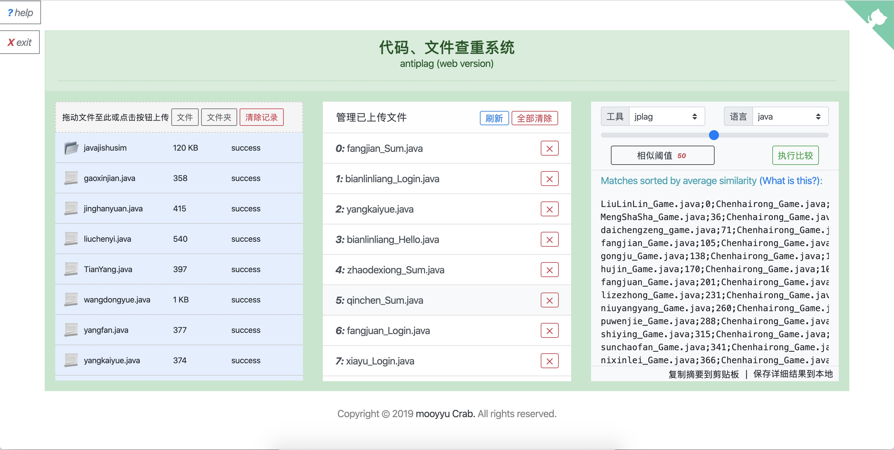

# antiplag-web

 A text-similarity computation software (web version) for the codes and documents of assignment.

This system is a web version based on [antiplag](https://github.com/fanghon/antiplag).

----

## requirement

- [jdk12 and above](https://www.oracle.com/technetwork/java/javase/downloads/index.html)

- Browser, such as [chrome](https://www.google.com/intl/zh-CN/chrome/)

- platform: mac, linux. (not tested windows platform)

## ScreenShot

## how to use

1. download the source zip file and unzip.

2. backstage: configure your database infomation with file **pom.xml** & **application.porperties**.

3. frontend: configure your host in file **main.js**.

4. package backstage by maven, build frontend by vue-cli3. then deploy and enjoy it.

## theory

The main techniques used by the system are string similarity comparison algorithms, code lexical grammar parsing, and word segmentation in natural language processing (nlp).

The similarity comparison of program text is based on 3 open systems:

* One is [MOSS system](http://theory.stanford.edu/~aiken/moss/) based on web services (Stanford University's open system that supports the similarity comparison of multiple programming language codes);
* The second is the [sim system](https://dickgrune.com/Programs/similarity_tester/) executed locally (supporting text similarity comparison in languages ​​such as java, c).
* The third is [jplag system](https://github.com/jplag/jplag/) which is executed locally (supporting text similarity comparison in languages ​​such as java, c / c ++, python).

The system has been developed and packaged on the basis of them. For the moss system, a client access module has been developed to implement code file submission, result acquisition and analysis, and result sequencing. For sim and jplag, the It is integrated into the system and can be used as a replacement product when moss is not available due to network failure or other reasons.

Comparison of Chinese and English document assignment similarity provides two algorithms:

The first is based on [shinglecloud algorithm](https://www.kom.tu-darmstadt.de/de/research-results/0/1/shinglecloud/) (a language fingerprint-based, language-independent similarity Fast calculation method), the main process of the document is as follows:

1. Use tika to read the text content in different encoding files in different formats (txt, doc, docx, pdf, html, etc.) and convert it into text that can be processed uniformly;
2. Use hanlp to preprocess and segment the text;
3. Calculate the similarity between texts using the singlecloud algorithm;
4. Sort according to similarity and output comparison results.

The second is based on jplag's GST algorithm, which has been expanded in functionality. The added "doc" language type can perform similarity calculations on various documents and provide a web-based visual comparison function.

### references:

1. [Software Plagiarism Detection Techniques: A Comparative Study](http://www.ijcsit.com/docs/Volume%205/vol5issue04/ijcsit2014050441.pdf)
2. [JPlag: Finding plagiarisms among a set of programs](http://page.mi.fu-berlin.de/prechelt/Biblio/jplagTR.pdf)
3. [Winnowing: Local Algorithms for Document Fingerprinting](http://theory.stanford.edu/~aiken/publications/papers/sigmod03.pdf) The core algorithm used by the moss system
4. [Summary of software plagiarism detection research](https://faculty.ist.psu.edu/wu/papers/spd-survey-16.pdf)
